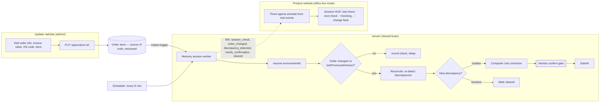

# ClearBorder Live — Product Website Implementation Plan (Google Antigravity)

> **Base:** fork of `https://github.com/DAKSHPATELL/medusa.git` (the current, most-advanced ClearBorder codebase).
> **Goal:** a **product-only** website (no pitch story) that shows the agent handling order updates **live**, driven by a persistent "memory session" that checks for changes on a schedule, plus a **separate updater website** to change order info.
> **Load-bearing primitive:** the persistent CaseFile — here made *continuous and visible*: the agent remembers the last state, checks for a delta, and acts only on what changed.
> **Rule:** one backend, two thin frontends. Reuse `server/` and `packages/core`; do not duplicate pipeline logic.

---

## 0. How to run this in Antigravity

Fork medusa, then build inside the fork. The three surfaces share one backend:

- **`server/`** (existing) — the brain. Gains an order store, a memory-session worker, and a few endpoints.
- **`office/` → live mode** — the **product website**. Reuses Scene 4's three agents + confirm gate, but drops the scripted beats. Agents animate from real events only.
- **`admin/`** (new) — the **updater website**. A small form to change order info. Writes to the order store.
- *(The demo `office` scripted mode stays available for pitching — the live behavior is product-only, behind a mode flag.)*

**Kickoff prompt (paste into Agent Manager):**

> Fork the medusa ClearBorder repo. Build "ClearBorder Live" per `ClearBorder-live-product-plan.md`: a product-only website that reuses the existing office Scene-4 agents in a new LIVE mode (no scripted story), a persistent memory-session worker that checks for order-info updates on a configurable interval AND on an instant trigger, and a separate `admin/` updater site to change order info. Reuse `server/` and `packages/core` — do not duplicate pipeline logic. Keep the human-confirm gate. Build Step 1 (live-mode product website) first, then pause for my review.

---

## 1. Architecture



**Flow in words:** someone edits the order on the **updater site** → it lands in the versioned **order store** → the **memory session** wakes (on its timer *or* instantly on the update) → `resume(environmentId)` → diff the order snapshot against what the case last processed → if it changed materially, reconcile (new discrepancy → Computer Use + human confirm; resolved → cleared) → the **product office** shows the agents handling it live.

---

## 2. Why this fits Statement Four (and reads as a product)

- The memory session **is** the persistence primitive, running continuously: it remembers the last-seen order and only acts on the delta. "It doesn't forget" becomes something judges watch happen.
- Computer Use still fires **only because** the session detected a material change — the causal chain is intact.
- Two websites talking through one persistent brain reads as a real SaaS integration, not a hackathon script.

---

## 3. Data model additions (`packages/core`)

```ts
// An order snapshot is the source of truth the updater edits.
export interface OrderSnapshot {
  ref: string;                 // shipment/order ref — links to the CaseFile
  version: number;             // bumped on every update
  updatedAt: string;
  fields: {
    invoiceValue?: number;
    packingListValue?: number;
    hsCode?: string;
    valueProofUrl?: string;
  };
}

// On the CaseFile, track what the session has already reconciled.
export interface CaseSessionState {
  environmentId: string;
  lastProcessedOrderVersion: number;   // idempotency marker
  lastCheckedAt?: string;
  nextCheckAt?: string;
  status: "idle" | "checking" | "reconciling" | "awaiting_approval";
}
```

`lastProcessedOrderVersion` is the key to idempotency: a check that sees `order.version <= lastProcessedOrderVersion` is a no-op, so the timer and the instant trigger can never double-process.

---

## 4. New endpoints (added to `server/`)

| Method | Path | Description |
|---|---|---|
| `GET` | `/api/orders/:ref` | Read the current order snapshot |
| `PUT` | `/api/orders/:ref` | Update order fields → bumps `version`, fires instant trigger |
| `POST` | `/api/session/:caseId/check-now` | Force an immediate memory-session check (demo convenience) |
| `GET` | `/api/session/:caseId/status` | Session HUD data: status, lastCheckedAt, nextCheckAt, lastProcessedOrderVersion |
| `WS` | `/ws` | Existing bus — adds events: `session_check`, `order_changed`, `cleared` |

Reuse existing endpoints unchanged: `/discrepancies`, `/correct`, `/confirm`, `/reject`, `/resume`.

---

## 5. Phased build

Each step = one Agent goal; pause for review after each.

### Step 1 — Product website: the office in LIVE mode (build first)
- **Goal:** A product-only site that reuses Scene 4's three agents + confirm gate, driven purely by real WS events — no intro, no story scenes, no scripted beats.
- **Files:** new `office` route/mode `?mode=live` (or a `product/` entry reusing office components); remove/skip `DemoController` beats in live mode; keep the pixel agents, WS subscription, and approval UI.
- **Acceptance:** opening the product site shows the three agents idle; firing any real pipeline event (via existing endpoints) animates them exactly as in Scene 4; the confirm gate works. No scripted content appears.
- **Verify:** trigger `/discrepancies` and `/correct` manually → agents react live → approve → submit. Screenshot the idle and active states.
- **Prompt:** *"Create a LIVE mode of the office that reuses the Scene 4 agents, WS subscription, and human-confirm gate but removes the scripted DemoController beats and all non-Scene-4 scenes. Opening it shows idle agents that animate only from real WS events. Verify by manually triggering the discrepancy and correct endpoints and confirming the agents react and the approval gate works."*

### Step 2 — Order store + updater website (`admin/`)
- **Goal:** A versioned order store as source of truth, and a small separate site to edit order info.
- **Files:** `server/src/orderStore.ts` (versioned, keyed by ref), `GET/PUT /api/orders/:ref`; new `admin/` Vite app with a form (invoice value, packing-list value, HS code, value proof) that reads and writes the snapshot.
- **Acceptance:** editing a field in `admin/` and saving bumps the order `version` and persists; `GET /api/orders/:ref` returns the new snapshot. Order store survives a server restart (reuse the CaseStore persistence approach).
- **Verify:** update a value in admin → confirm version increments and value persists across a restart.
- **Prompt:** *"Add a versioned `orderStore` (keyed by shipment ref, persisted like CaseStore) with `GET/PUT /api/orders/:ref`; PUT bumps version and updatedAt. Build a separate `admin/` Vite site with a form to view and edit order fields (invoice value, packing-list value, HS code, value proof). Verify updates persist and version increments across a server restart."*

### Step 3 — Memory session worker (scheduled check + diff + reconcile)
- **Goal:** A persistent worker that, on a configurable interval, resumes each active case, diffs the latest order snapshot against `lastProcessedOrderVersion`, and reconciles only on a material change.
- **Files:** `server/src/memorySession.ts` (scheduler + `checkCase(caseId)`), wiring into discrepancy re-detection, Computer Use, and cleared-state; `GET /api/session/:caseId/status`; `POST /api/session/:caseId/check-now`.
- **Behavior:** on each check → `resume(environmentId)` → if `order.version > lastProcessedOrderVersion`: re-run discrepancy detection on the new fields; a *new* discrepancy → start Computer Use correction (halts at confirm gate); a *resolved* one → mark cleared; then set `lastProcessedOrderVersion = order.version`. Emit `session_check` every wake and `order_changed` on a real delta. **Interval is env-configurable** (`SESSION_INTERVAL_MS`, default short for demo; document it as "10 min in production").
- **Acceptance:** with the interval set to ~20s, updating the order in `admin/` causes the next check to detect the delta and drive the pipeline; an unchanged order is a no-op; re-running a check twice does not double-process (idempotent via version marker).
- **Verify:** update order → within one interval the product office shows the agent reconciling → confirm gate → submit. Then run a check with no change → no-op. Screenshot the session status endpoint across states.
- **Prompt:** *"Build `memorySession.ts`: a scheduler (interval from `SESSION_INTERVAL_MS`, default ~20s) that for each active case calls resume(environmentId), compares order.version to lastProcessedOrderVersion, and only on a material change re-detects discrepancies and drives the pipeline (new discrepancy → Computer Use + confirm gate; resolved → cleared), then advances the version marker. Add `/api/session/:caseId/status` and `/api/session/:caseId/check-now`. Emit session_check and order_changed WS events. Verify: an order update is picked up within one interval; no change is a no-op; a repeated check does not double-process."*

### Step 4 — Instant trigger (so the demo never waits)
- **Goal:** When the updater saves, wake the memory session immediately — without disabling the scheduled cadence.
- **Files:** in `PUT /api/orders/:ref`, after bumping version, call the session worker's `checkCase` for the linked case (debounced); keep the timer running independently.
- **Acceptance:** saving in `admin/` reflects in the product office within ~2s, while the periodic timer still fires on its own for the "it checks every 10 minutes" narrative.
- **Verify:** save an update → agent reacts almost immediately; leave it idle → periodic `session_check` events still appear on schedule.
- **Prompt:** *"Make `PUT /api/orders/:ref` fire an immediate, debounced `checkCase` for the linked case after bumping the version, so updates are handled within ~2s, while the scheduled interval keeps running independently. Verify both the instant reaction and the ongoing periodic checks."*

### Step 5 — Product office session HUD + end-to-end live scenario
- **Goal:** Make the memory/persistence visible on the product site, and prove the whole loop.
- **Files:** a HUD in the product office showing `last check`, `next check` countdown, a live "checking…/reconciling…" indicator, and a small change feed ("invoice value updated → discrepancy resolved").
- **Acceptance:** from the product site you can watch: periodic checks tick by; an admin update arrives; the agent reconciles; the gate; the resolution — all labeled clearly. The HUD reads the real `/session/:caseId/status`.
- **Verify:** full live run: admin update → HUD shows checking → agents reconcile → approve → cleared → change feed updated. Record it as a backstop.
- **Prompt:** *"Add a session HUD to the product office showing last check, a next-check countdown, a live checking/reconciling indicator, and a change feed, all fed by /api/session/:caseId/status and WS events. Verify a full live run (admin update → HUD checking → agents reconcile → approve → cleared) and record it as a backstop."*

### Step 6 — Polish, config & backstop
- **Goal:** demo-safe, resettable, and clearly configured.
- **Files:** a `Reset` for the product case; documented env (`SESSION_INTERVAL_MS`, `CASE_STORE`); recorded run.
- **Acceptance:** cold start works; interval is one env change; a recorded run exists for network failures.
- **Verify:** run end-to-end 3× back-to-back; confirm reset and recording.

---

## 6. Risk & fallback

| Risk | Mitigation |
|---|---|
| 10-min interval kills a live demo | Interval is env-configurable (short for demo) **and** an instant trigger wakes the session on save. |
| Timer + trigger double-process the same update | `lastProcessedOrderVersion` idempotency marker; a check with no new version is a no-op. |
| Two frontends drift from duplicated logic | One shared `server/` + `packages/core`; the frontends are thin. |
| Scope creep beyond the working base | Additive only: live mode reuses Scene 4; no pipeline rewrite. |
| Leaked secrets when forking a public repo | Confirm `server/.env` is gitignored before the first push; keep `.env.example` only. |
| Order updates from an untrusted site | Note for production: auth between admin/ and server (out of demo scope, but stated). |

---

## 7. Definition of done

- Product website shows the Scene-4 agents in **live mode**, driven only by real events, with a working confirm gate.
- A separate `admin/` site updates versioned order info; the **memory session** picks up changes on its interval **and** instantly on save, reconciles only on material deltas, and is idempotent.
- The product office HUD makes the periodic memory checks and reconciliation visible.
- Full live loop runs cold in one sitting, is resettable, and has a recorded backstop.
- Built in a fork of medusa, secrets never committed.

*Guardrails unchanged: portal is the local mock, `CASE_STORE` persisted, secrets in `server/` only, human approval required before any submit.*
